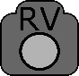
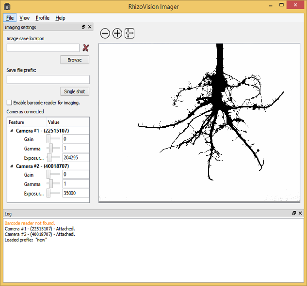

#  RhizoVision Imager

RhizoVision Analyzer is an application that connects to multiple Basler USB 3.0
vision cameras to take picture of an object from multiple views or take multiple
parts of an object. The program supports taking pictures from cameras using
barcode reader.

#### Downloading
The software binary can be downloaded [here](https://zenodo.org/record/2585881).

The source code repository is located [here](https://github.com/rootphenomicslab/RhizoVisionImager).

#### Running the Program

The program opens a GUI where it automatically connects to Basler USB 3.0 vision cameras.
All the connected cameras are shown in the left pane arranged in the ascending order of
the camera serial numbers. Each camera is given a number from one to the number of cameras
in the in the ascending order of the camera serial numbers. Upon starting the program
displays live view of the camera with the smallest serial number. The live view camera
can be changed from the menu View. The program needs a save location to store the captured
images. The file name of each image capture from each camera is appended by c1, c2 ... etc.
The program never deletes or overwrites the images if they are already present. Instead,
the file names are appended with p1, p2, ... etc.

#### Pre-requisites for Running the Program

This program needs an x86_64 processor. Any Intel or AMD processor may be used
for running the program.

#### Compiling the Source

The source code is compiled using Microsoft Visual Studio. The program depends on
Qt, OpenCV and cvutil libraries for compiling the source.

#### Copyright and License

Copyright (C) 2018-2019 Noble Research Institute, LLC

**RhizoVision Imager**

RhizoVision Imager is free software: you can redistribute it and/or modify
it under the terms of the GNU General Public License as published by
the Free Software Foundation, either version 3 of the License, or
(at your option) any later version.

RhizoVision Imager is distributed in the hope that it will be useful,
but WITHOUT ANY WARRANTY; without even the implied warranty of
MERCHANTABILITY or FITNESS FOR A PARTICULAR PURPOSE.  See the
GNU General Public License for more details.

You should have received a copy of the GNU General Public License
along with RhizoVision Imager.  If not, see <https://www.gnu.org/licenses/>.

#### Citing
Please use the following citation when using the software.

> Anand Seethepalli, & Larry York. (2019, March 6). RhizoVision Imager: Software to control machine vision cameras for plant phenotyping (Version 1.0). Zenodo. http://doi.org/10.5281/zenodo.2585882
> 
> 

#### Authors

Please send any comments/suggestions/improvements for the program to the authors:

Anand Seethepalli,  
Computer Vision Specialist,  
Root Phenomics Lab,  
Noble Research Institute, LLC  

email:  
aseethepalli@noble.org  
anand_seethepalli@yahoo.co.in  

Larry York,  
Principal Investigator  
Root Phenomics Lab,  
Noble Research Institute, LLC  

email:  
lmyork@noble.org  
